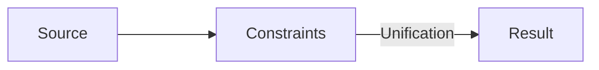
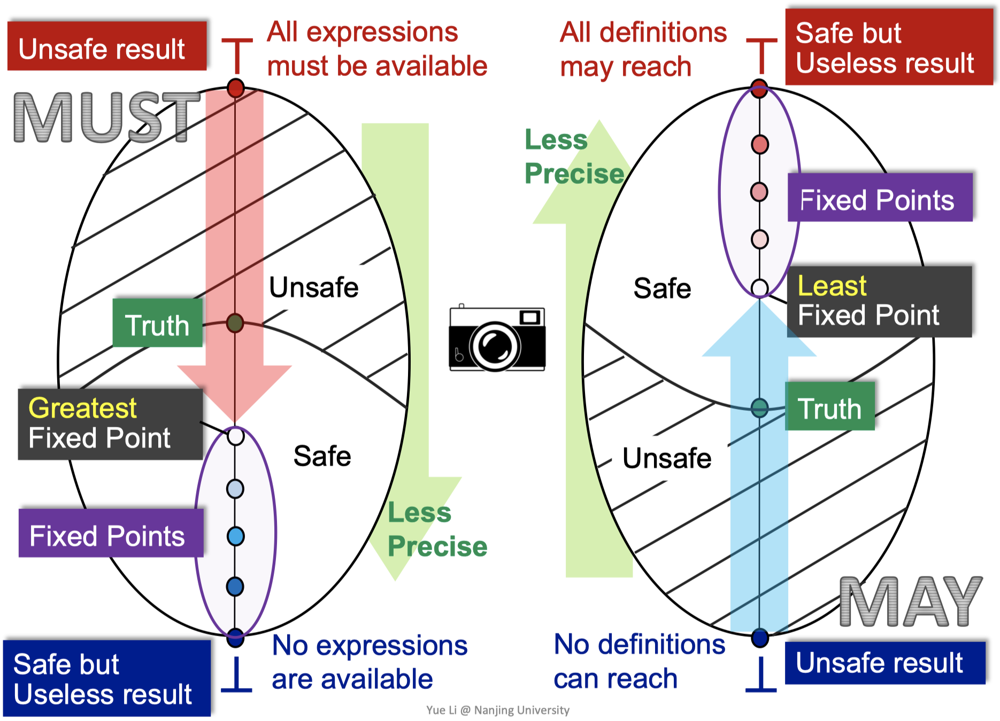

# Static Program Analysis

Book: https://users-cs.au.dk/amoeller/spa/

### Applications

- Optimization
- Correctness
- Development

The input/behavior of nontrivial programs are undecidable.

### The Tiny Imperative Language

- Syntax
- Normalization
- AST
- CFG

### Type Analysis

```rs
Type -> int
      | ↑Type
      | (Type, ..., Type) -> Type

      // Infinite types (caused by recursion)
      | μ TypeVar. Type
      | TypeVar

      // Record
      | { Id: Type, ..., Id: Type }
      | ◊  // Absent field

TypeVar -> t | u | ...
```



Polymorphic + recursive = undecidable type analysis.

Limits:

- flow-sensitive
- polymorphic
- ignores other kinds of runtime errors

## Lattice Theory

### Partially ordered set

- Reflexive
- Transitive
- Antisymmetric

### Lattice

- Least upper bound (join)
- Greatest lower bound (meet)

Complete lattice: every subset has a join and a meet.

- Top $\top$
- Bottom $\bot$

Examples:

- Powerset lattice $(\mathcal{P}(S), \subseteq)$
- Flat lattice $\text{flat}(A)$
- Product lattice $L_1 \times L_2$
- Function lattice $L_1 \to L_2$

Homomorphism:

- Homomorphism: $f: L_1 \to L_2$ such that $f(x \sqcup y) = f(x) \sqcup f(y) \land f(x \sqcap y) = f(x) \sqcap f(y)$
- Isomorphism = bijective homomorphism

$\text{lift}(L)$: $L$ with a new bottom element

Equation System:

fixed point, least fixed point (LFP)

For monotonic function $f: L \to L$, $\text{LFP}(f) = \sqcup_{i=0}^\infty f^i(\bot)$

## Dataflow Analysis with Monotone Frameworks

### Sign analysis, Constant propagation analysis:

- $\text{JOIN}(v) = \sqcup_{w \in \text{pred}(v)} [[w]]$
- `X=E`: $[[v]] = \text{JOIN}(v)[X \mapsto \text{eval}(\text{JOIN}(v), E)]$
- `var X`: $[[v]] = \text{JOIN}(v)[X \mapsto \top]$

### Live variable analysis:

- $\text{JOIN}(v) = \cup_{w \in \text{succ}(v)} [[w]]$
- `X=E`: $[[v]] = \text{JOIN}(v) \setminus \{X\} \cup \text{vars}(E)$
- `if (E)`, `output E`: $[[v]] = \text{JOIN}(v) \cup \text{vars}(E)$
- `var X`: $[[v]] = \text{JOIN}(v) \setminus \{X\}$
- `exit`: $[[v]] = \emptyset$

### Available expressions analysis:

- State = (P({exprs}), $\subseteq$)
- $\text{JOIN}(v) = \cap_{w \in \text{pred}(v)} [[w]]$
- `X=E`: $[[v]] = \text{JOIN}(v) \cup \{E\}$ removed all expressions that contain $X$
- `if (E)`, `output E`: $[[v]] = \text{JOIN}(v) \cup \{E\}$

### Very busy expressions analysis:

- $\text{JOIN}(v) = \cap_{w \in \text{succ}(v)} [[w]]$
- `X=E`: $[[v]] = \text{JOIN}(v)$ removed all expressions that contain $X \cup \{E\}$
- Usage: "Code hoisting"

### Reaching definitions analysis:

- State = (P({definitions}), $\subseteq$)
- $\text{JOIN}(v) = \cup_{w \in \text{pred}(v)} [[w]]$
- `X=E`: $[[v]] = \text{JOIN}(v) \downarrow \{X\} \cup \{v\}$
- Usage: "DCE", "Code motion"

### Summary

|      | Forward               | Backward              |
| ---- | --------------------- | --------------------- |
| May  | Reaching definitions  | Live variables        |
| Must | Available expressions | Very busy expressions |



Transfer function: $[[v]] = t_v(\text{JOIN}(v))$

## Widening and Narrowing

- Allowing lattices with infinite height to converge.
- Accelerate finite height lattices.

1. Widening: $B$
2. Narrowing: Not guaranteed to converge. Heuristics must determine how many iterations to apply.

Widening operator: $\nabla: L \times L \to L$:

- Only apply widening at recursive dataflow constraints.

## Path Sensitivity

### Assertions: $\texttt{assert}(E)$

- Trivial: $[[\texttt{assert}(E)]] = \text{JOIN}(v)$
- Predicates: $[[\texttt{assert}(E > 0)]] = \text{JOIN}(v)[X \mapsto \text{gt}(\text{JOIN}(v)(X), \text{eval}(\text{JOIN}(v), E))]$
- Sound & Monotone

### Relations

- $L'' = \text{Path} \to L$
- `flag=0`: $[[v]] = [\texttt{flag}=0 \mapsto \cup_{p \in \text{Path}}{\text{JOIN}(v)(p)},\texttt{flag}\neq 0 \mapsto \emptyset]$
- `assert(flag)`: $[[v]] = [\texttt{flag}=0 \mapsto \emptyset,\texttt{flag}\neq 0 \mapsto \text{JOIN}(v)(p)(\texttt{flag}\neq 0)]$

## Interprocedural Analysis

### Context Sensitivity

Using the lattice $(\text{Context} \to \text{lift}(\text{State}))^n$. The bot of $\text{lift}(\text{State})$ is "unreachable".

- $\text{Context} = \text{Singleton}$: Context-insensitive
- $\text{Context} = \text{Call}^{\leq k}$: Call string approach
- $\text{Context} = \text{State}$: Functional approach: full context sensitivity

## Distributive Analysis Frameworks

### Possibly-Uninitialized Variables Analysis

- Monotone framework: not scalable
- Pre-analysis + Main analysis:
  - Pre-analysis:
    - Lattice: $(\text{lift}(\mathcal{P}(\text{Var}) \to \mathcal{P}(\text{Var})))^n$
    - `X=E`: $[[v]]_1 = t_{X=E} \circ \sqcup_{w \in \text{pred}(v)} [[w]]_1 \ \text{or} \ \texttt{unreachable}$
  - Main analysis
    - Lattice: $(\text{lift}(\mathcal{P}(\text{Var})))^n$
    - Non-entry node: $[[v]]_2 = [[v]]_1([[v']]_2) \ \text{or} \ \texttt{unreachable}$


### Compat Representation of Distributive Functions

1. $f: \mathcal{P}(D) \to \mathcal{P}(D)$ which is distributive, and $D$ is a finite set.
    - Used in: "Pre-analysis" above, the IFDS framework
    - A special case of 2.

$\{\bullet \to \bullet\} \cup \{\bullet \to y | y \in f(\emptyset) \} \cup \{ x \to y | x \in f(\{x\}) \land y \notin f(\emptyset) \}$

```txt
·  d1  d2  d3  d4
|\          \  |
| \          \ |
|  \          \|
·  d1  d2  d3  d4
```

2. $f: (D \to L) \to (D \to L)$ which is distributive and $D$ is a finite set and $L$ is a complete lattice.
    - Used in: the IDE framework

Define $g: (D \cup \{\bullet\}) \times (D \cup \{\bullet\}) \to (L \to L)$

$$
\begin{aligned}
g(d_1, d_2)(e) &= f(\bot[d_1 \mapsto e])(d_2) \\
g(\bullet, d_2)(e) &= f(\bot)(d_2) \\
g(\bullet, \bullet)(e) &= e \\
g(d_1, \bullet)(e) &= \bot \\
\end{aligned}
$$

### The IFDS Framework

> Interprocedural, Finite, Distributive, Subset

- Lattice: $\mathcal{P}(D)$ of a finite set $D$
- Transfer functions: $t_v: \mathcal{P}(D) \to \mathcal{P}(D)$ are distributive

#### Phase 1

- $\langle v_0, d_0 \rangle \rightsquigarrow \langle v_1, d_1 \rangle \in \textbf{P} \land \langle v_1, d_1 \rangle \to \langle v_2, d_2 \rangle \in \textbf{E} \implies \langle v_0, d_0 \rangle \rightsquigarrow \langle v_2, d_2 \rangle \in \textbf{P}$

#### Phase 2

- $\forall d_1, d_2: \langle v_0, d_1 \rangle \rightsquigarrow \langle v, d_2 \rangle \in \textbf{P} \implies d_2 \in [[v]]$, where $v_0$ is the entry node of the function containing $v$.

### The IDE Framework

> Interprocedural, Distributive, Environment

- Lattice: $D \to L$, where $D$ is a finite set and $L$ is a complete lattice (the "environment")
- Transfer functions: $t_v: (D \to L) \to (D \to L)$ are distributive

#### Phase 1

- $m_1 = [[\langle v_0, d_1 \rangle \rightsquigarrow \langle v', d_2 \rangle]]_\textbf{P} \neq \bot \land m_2 = [\langle v', d_2 \rangle \to \langle v, d_3 \rangle]_\textbf{E} \neq \bot \implies m_2 \circ m_1 \sqsubseteq [[\langle v_0, d_1 \rangle \rightsquigarrow \langle v, d_3 \rangle]]_\textbf{P}$

#### Phase 2

- $\forall d_0, d: [[\langle v_0, d_0 \rangle]] \neq \texttt{unreachable} \land m = [[\langle v_0, d_0 \rangle \rightsquigarrow \langle v, d \rangle]]_\textbf{P} \implies m([[\langle v_0, d_0 \rangle]]) \sqsubseteq [[\langle v, d \rangle]]$

#### Properties of the IFDS and IDE Frameworks

- Produces meet-over-all-paths solutions
- The worst-case time complexity is: $\mathcal{O}(|E|\cdot|D|^3)$

## Control Flow Analysis

> TODO
